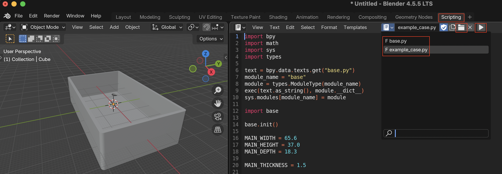

# 3DPartsModel

3D modeling project using Blender Python scripts

## Requirements

- [Blender](https://www.blender.org/) 4.5 or later
- GNU Make

## Overview

This project generates 3D models using Blender's Python API.
Instead of manual GUI modeling, models are defined parametrically through code, ensuring reproducibility and maintainability.



## Usage

### Generate STL files

```bash
make all
```

This generates `.stl` files from all `.py` files.

### Generate a specific file

```bash
make raspberry-pi-5b/top.py.stl
```

### Cleanup

```bash
make clean
```

## Directory Structure

Each directory contains case models for the target device:

- `raspberry-pi-*` - Raspberry Pi series
- `radxa-rock-*` - Radxa Rock series
- `jetson-*` - NVIDIA Jetson series
- `iflight-protek35` - iFlight ProTek35

## base.py

`base.py` provides common modeling functions:

| Function | Description |
|----------|-------------|
| `create_cube` | Create a cube |
| `add_cube` / `cut_cube` | Add/subtract a cube |
| `create_cylinder` | Create a cylinder |
| `add_cylinder` / `cut_cylinder` | Add/subtract a cylinder |
| `add_ring` | Add a ring shape |
| `cut_holes` | Cut multiple holes |
| `cut_corners` | Round the corners |

## Editing in Blender

1. Open Blender
2. Switch to the Scripting tab
3. Open `base.py` and the target `.py` file
4. Run the script to preview
